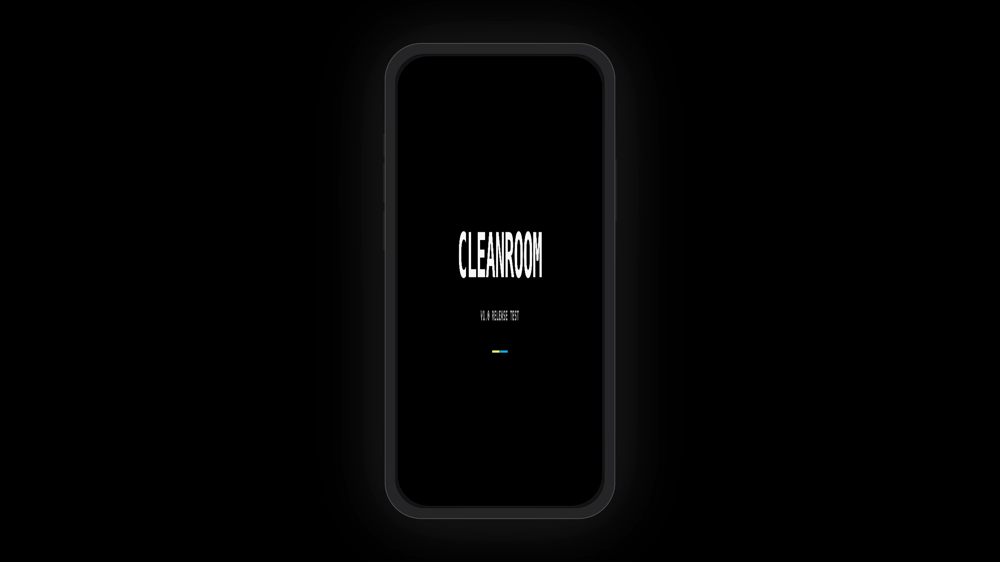
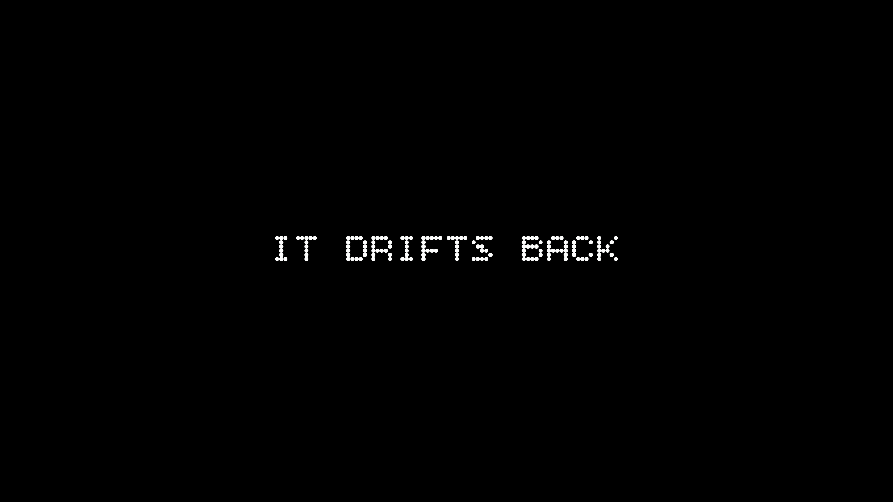
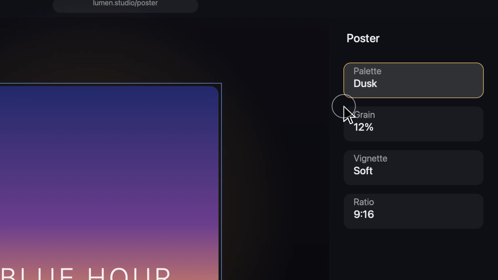

# product-film

**An agent skill that turns screen recordings into scored, verified product films.** One `SKILL.md` plus plain Swift scripts, nothing agent-specific inside — it runs on any agent that reads the format (Codex, Cursor and Claude Code today).

Point your agent at your product — an iOS app, a website, a desktop app, or a Figma prototype — and it gains the full production pipeline, **self-contained in this one install**: from capturing the takes to delivering the final scored MP4, nothing else to download.

- **Capture** — record the takes itself (ScreenCaptureKit recorder, staging checklists, pre-roll gate), or start from recordings you already have
- **Measure** — find the real interaction times in the footage, so every cut lands where something actually happens
- **Cut** — splice the beats, never mid-animation
- **Composite** — camera moves and click cues; device mockup for mobile, Screen-Studio-style full-bleed for desktop
- **Stitch** — scenes into acts, with title cards and transitions between them
- **Score** — a synthesized, license-free soundtrack matched to the film's stated vibe
- **Audit** — the final cut graded scene-by-scene against the approved script

All of it on AVFoundation alone: no ffmpeg, no video editor, no cloud rendering. Every stage is a plain Swift script you can also run by hand.

| Mobile path — from the Oryne launch film | End card — in the product's brand font |
|---|---|
|  |  |

| Desktop path — from the [Inkwork](https://malikzhang.com/inkwork) film |
|---|
|  |

Every frame above is unretouched pipeline output from two shipped films. The desktop shot is full-bleed, Screen-Studio style: the page fills the canvas at every zoom level, so no black margin or card edge can slide into frame. Desktop apps and landscape Figma prototypes get the same treatment.

## Why it exists

Agent-cut product films tend to fail the same few ways: trims made from *intended* timings instead of measured ones, cuts landing mid-animation, reveals with no visible click, zooms focused on the wrong thing, watermarked stock audio, cards carrying the last project's copy.

Every rule in this skill is a codified rejection from a real film delivery. The playbook is the accumulated taste; the verification gates — frame-scan before trimming, full-resolution card reads, a gap audit delivered with every render — are what keep quality stable from one session to the next.

## Requirements

- macOS with Xcode Command Line Tools (`swift` on PATH; `python3`, stock on macOS, for the camera-plan derivation)
- Any agent that reads `SKILL.md` skills — e.g. [Codex](https://developers.openai.com/codex), [Cursor](https://cursor.com), [Claude Code](https://claude.com/claude-code)
- For iOS Simulator capture: Xcode (`DEVELOPER_DIR=/Applications/Xcode.app/Contents/Developer`)

That's everything — no companion downloads; capture tools ship in `scripts/` (compiled once on first use with `swiftc -O`, as the docs instruct the agent).

## Install

**curl** — installs for every supported agent (one real copy, the rest symlinked to it):

```bash
curl -fsSL https://raw.githubusercontent.com/Malik1942/product-film/main/install.sh | bash
```

Narrow it to the agents you use, or scope it to a single repo:

```bash
./install.sh --codex --cursor
```

```bash
./install.sh --project
```

**git / gh** — clone straight into a directory your agent reads. `.agents/skills/` is the shared cross-agent convention, so it's the widest default:

```bash
git clone https://github.com/Malik1942/product-film.git ~/.agents/skills/product-film
```

| Skills directory | Read by |
|---|---|
| `~/.agents/skills/` | Codex, Cursor |
| `~/.claude/skills/` | Claude Code, Cursor |
| `~/.cursor/skills/` | Cursor |
| `~/.codex/skills/` | Cursor, older Codex builds |

The `~/` paths make the skill available in every project; swap `~/` for `<repo>/` to scope it to one repo and commit it with the project. Any of these directories can be a symlink to a single checkout — that's what `install.sh` sets up, so one `git pull` updates every agent. There's no registration step anywhere: agents discover `SKILL.md` on their own.

## How to prompt

**1 — Start with one sentence: the goal, and where the footage is (or will come from).**

```text
Make a 60-second promo film for my app. Raw recordings are in ~/Desktop/MyAppTakes.
```

```text
Film my website at example.com into a Screen-Studio-style demo.
```

If your agent supports explicit invocation you can also name it directly — `$product-film` in Codex, `/product-film` in Cursor and Claude Code.

**2 — It answers with a film script to fill in, not a render.** That's the approval gate: no expensive renders until the direction is agreed. The script is six blocks — all the information the film is built from (fill-in template: [`references/writing-the-script.md`](references/writing-the-script.md)):

| You provide | Example |
|---|---|
| Product & surface | iOS app on a simulator · website URL · Figma prototype link |
| Placement & length | landing page · ~60s · 2560×1440 |
| Vibe | "calm and premium, like a sundown ambient track — avoid busy percussion" |
| Scenes, one idea each | the click to show · the payoff to read (exact text/number) · the data that must exist first |
| Words | opening tagline · title-card texts · end-card line + CTA |
| Brand | card font (`.ttf` or installed name) · accent colors · logo |
| Sound | a reference track or mood — otherwise synthesized to the vibe |

Skip the vibe and it will ask — offering two or three named directions to pick from — because vibe drives the cut rhythm, camera energy, card tone and the entire score.

A filled script is short. Compressed from a real film:

```text
FILM: Inkwork promo   SURFACE: website — malikzhang.com/inkwork   PLACEMENT: landing page
CANVAS: 2560x1440     LENGTH: ~45s
VIBE: playful and energetic — plucked, moving; biggest moment: the Arcade reveal
SCENES:
1. Create a QR — interaction: type URL, click Create · payoff: branded QR + "Scannable" · data: none · ~8s
2. Styles — interaction: click style cards · payoff: QR restyles live in the Proof panel · ~8s
TITLE CARDS: before 2 — "BREAK THE GRID"
END CARD: logo + "DESIGNED AND BUILT BY MALIK"
BRAND: default font, accents FFEE51,0EA5E9   SOUND: playful, bell motif at the reveal
```

**3 — Approve the script and the pipeline runs**: capture → measure → cut → composite → stitch → score → mux. Every delivery arrives with frame verification **and a scene-by-scene gap audit** — each scene of the actual rendered file graded against the script (MET / PARTIAL / CONTRADICTED / MISSING / DEVIATES) from extracted frames, editing gaps fixed before delivery, capture gaps named plainly.

**4 — Style it, any time — before the first render or after the tenth.** Direction works at two levels, and the skill knows the difference:

- **Vibe-level** cascades to every surface — edit rhythm, camera energy, cards, animation, score move together:
  `"Make it warmer and more playful."` · `"Calmer, more premium."`
- **Scoped** touches only what you named, and asks before spreading:
  `"Make the logo gold on the end card."` · `"Slow the title card entrance."` · `"White accent bars on the cards."`

The skill's built-in taste (zoom-through transitions, click cues, pacing) is a default, not a cage — explicitly ask for anything and it applies to your film. Only the engineering gates don't bend: measured trims, frame verification, the gap audit, and no watermarked audio.

Fixing a delivered cut works the same conversational way:

```text
The page turn in scene 2 feels laggy and the zoom focuses on the wrong thing. Fix both.
```

## What's inside

| Path | What |
|---|---|
| `SKILL.md` | Triggers, pipeline order, non-negotiables, symptom→fix table |
| `references/playbook.md` | Stage contracts, script arguments, camera grammar, iron laws |
| `references/capture-protocol.md` | Capture stage: staging checklists (sim / web / Figma proto), per-take protocol, HiDPI maths |
| `references/writing-the-script.md` | The six-block film-script contract + fill-in template |
| `references/gap-audit.md` | The mandatory per-render audit format |
| `scripts/` | The whole pipeline: capture (sckrecord, rollgate, autoplan, conform), measure (scan, diffscan ×2), cut (condense), composite2, stitch, score ×2, mux, title/end cards |
| `assets/iphone-mockup.png` | Neutral device frame (generated, MIT-licensed) |

Scripts come in two classes. **Utilities** run as-is with explicit arguments: `swift scripts/mux.swift film.mp4 score.m4a out.mp4`. **Templates** (stitch, score) are copied into your project and edited in-file — the clip order and chord tables *are* the interface. No script contains machine-specific or `/tmp` paths, and nothing depends on which agent is driving: every stage runs by hand from a shell.

## Device frames

The bundled frame is a clean generated bezel (safe to redistribute). For a photorealistic device, drop in any bezel image with a transparent screen cutout — e.g. Apple's official product bezels from [Apple Design Resources](https://developer.apple.com/design/resources/) (check Apple's usage terms):

```bash
FRAME_PNG=/path/to/bezel.png SCREEN_RECT=x,y,w,h swift scripts/composite2.swift ...
```

## Capture-only sibling

Everything needed for the full pipeline — **capture included** — ships in this repo; install it and you're ready, nothing else to download. The capture stage (staging checklists, per-take protocol, `sckrecord`, `autoplan.py`) is also published standalone as **[screen-recording](https://github.com/Malik1942/screen-recording)** for people who only want clean product captures without the film pipeline. If both are installed, they compose; neither requires the other.

## Contributing

See [CONTRIBUTING.md](CONTRIBUTING.md) — mechanics changes are normal PRs; taste-law changes go through the ratification gate described there.

## License

MIT — see [LICENSE](LICENSE). Brand fonts are never bundled; supply yours per project via `FONT_FILE`.

---

Built by [Malik Zhang](https://malikzhang.com).
